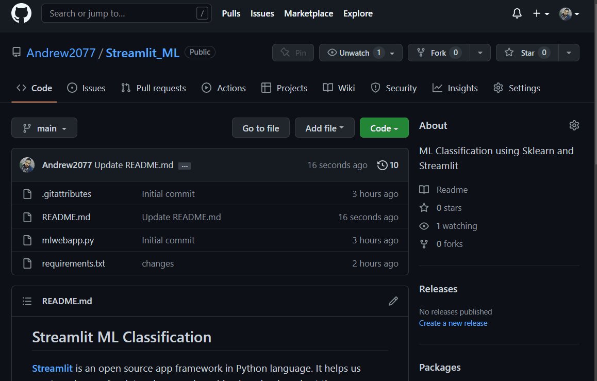

## **Streamlit ML Classification**

**[Streamlit](https://streamlit.io)** is an open source app framework in Python language. It helps us create web apps for data science and machine learning in a short time

Here is my <a href="https://andrew2077-streamlit-ml-mlwebapp-ixwgcf.streamlitapp.com" target="_blank">Web App.V1.0</a>
-- *open in a new tap [**Preview**](#preview)* --
give it a visit and explore how Machine learning classification algorithms works 

- Shared on & Hosted by Streamlit Cloud


---

## **Table Of Contents**

- [**Streamlit ML Classification**](#streamlit-ml-classification)
- [**Table Of Contents**](#table-of-contents)
- [**The Idea of the App**](#the-idea-of-the-app)
- [**Preview**](#preview)
- [**Deploying without Streamlit Cloud**](#deploying-without-streamlit-cloud)
- [**Features**](#features)
- [**Future improvements**](#future-improvements)

---

## **The Idea of the App**

Demonstrate the effectiveness of a machine learning model to classify data, while visualizing the results.

---
## **Preview**



---

## **Deploying without Streamlit Cloud**

- open **[mlwebapp](mlwebapp.py)** and run in terminal
- you will have to run it through Streamlit 
- write the following command in terminal after running 
    ```
    streamlit run mlwebapp.py
    ``` 
---

## **Features**

- Select a model from a dropdown menu provided from a list of models that were trained using the [sklearn](https://scikit-learn.org/) library.
- Select a dataset from a dropdown menu provided from a list of datasets that were imported using sklearn.
- plot the the classified data using a scatter plot on a 2D plane, using the PCA algorithm. to reduce the dimensionality of the data.

---


## **Future improvements**

- Adding more Parameters for Tuning the model _[under development]_
- Adding decision plot _[under development]_
- Adding a heatmap _[under development]_
- Adding an option for 3D plot _[under development]_
- Interactivity

---
